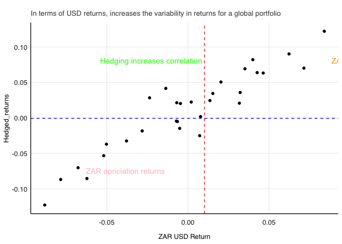

# Question 1

# Goal

-   im going to show the after gross and new fee performance for an
    actively managed funds to that of the SWIX.

-   going to simply take the funds that have survived the longest to
    have information on full performance versus the benchmark. Before
    and After fees ofcourse

``` r
# loadings 
library(pacman )
p_load("tidyverse" ,'gt', 'PerformanceAnalytics', 'quadprog', 'fmxdat', 'kableExtra','readr')

ASISA <- read_rds("data/ASISA_Rets.rds")
BM <- read_rds("data/Capped_SWIX.rds") 
AI <- read_rds("data/AI_Max_Fund.rds")

# clean up the data to merge the datasets, its already monthly data
ASISA <- ASISA %>% select(date, Fund, Returns)
AI <- AI %>% mutate(`Fund` = " AI") %>% rename(Returns = `AI_Fund`) %>%  select(date, Fund, Returns )
BM <- BM %>% rename( Fund = "Tickers")

# create a function that will get net of fee return
fee_calc <- function(df, fee) {
  
# annualize the rate 
  feeconverter <- function(fee) { 
    fee_monthly = (1 + fee / 10000)^(1 / 12) - 1
    fee_monthly
  }
  
  df <- df %>% 
    mutate(`Net of fees` = Returns - feeconverter(fee))  # Corrected the feeconverter argument
  
  return(df)  # Explicitly return the modified dataframe
}
```

``` r
# lets find worthy compaarables in terms of survivors in funds that can be used to make our case 
# and get  the best, worst and median performing funds 

Funds_inception_in_2003 <- ASISA %>%
  arrange(date) %>%
  group_by(Fund) %>%
  mutate(Y = format(date,"%Y")) %>% filter(Y %in% 2003) %>% select(Fund) %>% distinct() %>% pull()

#  sanity check

# ASISA %>%
#   filter(Fund %in% Funds_inception_in_2003$Fund) %>%
#   mutate(YM = format(date, "%Y-%m")) %>%
#   group_by(Fund) %>%
#   summarise(HasRecordsFor2023 = all(2023 %in% year(date))) %>%
#   filter(HasRecordsFor2023) %>%
#   select(Fund)

# top performance without feees

top_funds_comparison_to_the_benchmark <- ASISA %>%
  arrange(date) %>%
  group_by(Fund) %>%
  filter(Fund %in%Funds_inception_in_2003) %>%
  select(date, Fund, Returns) %>%
    mutate(YM = format(date, "%y %b")) %>% 
  summarise(Inception = first(date), Cumulative_Return = prod(1 + Returns)) %>%
  arrange(desc(Cumulative_Return)) %>%
  slice_head(n = 5) %>% bind_rows(BM %>% filter(date >= lubridate::ymd(20031031)) %>% summarise(Fund = "SWIX",Inception = first(date),  Cumulative_Return = prod(1 + Returns)))# this is before fees 


 kable (top_funds_comparison_to_the_benchmark)
```

<table>
<thead>
<tr>
<th style="text-align:left;">
Fund
</th>
<th style="text-align:left;">
Inception
</th>
<th style="text-align:right;">
Cumulative_Return
</th>
</tr>
</thead>
<tbody>
<tr>
<td style="text-align:left;">
X1064
</td>
<td style="text-align:left;">
2003-10-31
</td>
<td style="text-align:right;">
22.30866
</td>
</tr>
<tr>
<td style="text-align:left;">
N924
</td>
<td style="text-align:left;">
2003-10-31
</td>
<td style="text-align:right;">
21.44700
</td>
</tr>
<tr>
<td style="text-align:left;">
H216
</td>
<td style="text-align:left;">
2003-10-31
</td>
<td style="text-align:right;">
20.59711
</td>
</tr>
<tr>
<td style="text-align:left;">
M247
</td>
<td style="text-align:left;">
2003-10-31
</td>
<td style="text-align:right;">
20.17969
</td>
</tr>
<tr>
<td style="text-align:left;">
Q927
</td>
<td style="text-align:left;">
2003-10-31
</td>
<td style="text-align:right;">
19.61965
</td>
</tr>
<tr>
<td style="text-align:left;">
SWIX
</td>
<td style="text-align:left;">
2003-10-31
</td>
<td style="text-align:right;">
13.81490
</td>
</tr>
</tbody>
</table>

``` r
# now net of fee returns 

top_funds<- ASISA %>%
  arrange(date) %>%
  group_by(Fund) %>%
  filter(Fund %in%Funds_inception_in_2003) %>%
  select(date, Fund, Returns) %>%
    mutate(YM = format(date, "%y %b")) %>% 
  summarise(Inception = first(date), Cumulative_Return = prod(1 + Returns)) %>%
  arrange(desc(Cumulative_Return)) %>%
 slice_head(n = 5) %>% select(Fund) %>% distinct %>% pull()

Net_of_top_managers  <- ASISA %>% 
    filter (Fund %in% top_funds) %>% 
    mutate(YM = format(date, "%y %b")) %>%
    group_by(YM) %>% 
    filter(date == last(date)) %>% ungroup() %>% select(-YM ) %>% 
    mutate(fee_calc(., 150)) %>% 
    group_by(Fund) %>% 
    summarise(Inception = first(date), Cumulative_Return = prod(1 + `Net of fees`) - 1) %>%
  arrange(desc(Cumulative_Return)) %>% 
    bind_rows(BM %>% filter(date >= lubridate::ymd(20031031)) %>% summarise(Fund = "SWIX",  Inception = first(date), Cumulative_Return = prod(1 + Returns))) # after fees 

kable(Net_of_top_managers)
```

<table>
<thead>
<tr>
<th style="text-align:left;">
Fund
</th>
<th style="text-align:left;">
Inception
</th>
<th style="text-align:right;">
Cumulative_Return
</th>
</tr>
</thead>
<tbody>
<tr>
<td style="text-align:left;">
X1064
</td>
<td style="text-align:left;">
2003-10-31
</td>
<td style="text-align:right;">
15.61707
</td>
</tr>
<tr>
<td style="text-align:left;">
N924
</td>
<td style="text-align:left;">
2003-10-31
</td>
<td style="text-align:right;">
14.96728
</td>
</tr>
<tr>
<td style="text-align:left;">
H216
</td>
<td style="text-align:left;">
2003-10-31
</td>
<td style="text-align:right;">
14.34020
</td>
</tr>
<tr>
<td style="text-align:left;">
M247
</td>
<td style="text-align:left;">
2003-10-31
</td>
<td style="text-align:right;">
14.02964
</td>
</tr>
<tr>
<td style="text-align:left;">
Q927
</td>
<td style="text-align:left;">
2003-10-31
</td>
<td style="text-align:right;">
13.60577
</td>
</tr>
<tr>
<td style="text-align:left;">
SWIX
</td>
<td style="text-align:left;">
2003-10-31
</td>
<td style="text-align:right;">
13.81490
</td>
</tr>
</tbody>
</table>

-   from this we see that top managers have the ability to consistently
    beat the benchmark that returns to investors over a long investment
    would have resulted in higher returns whter this was gross or net of
    fees

``` r
# now for the distributional arguments

# top manager

Monthly_returns <- ASISA %>% 
    filter (Fund %in% top_funds) %>% 
    mutate(YM = format(date, "%y %b")) %>%
    group_by(YM) %>% 
    filter(date == last(date)) %>%
    ungroup() %>% select(-YM )

BM <- BM %>% filter(date >= lubridate::ymd(20031031))

combined_return <- bind_rows(BM, Monthly_returns) %>% group_by(Fund) 

topmanager <- combined_return %>%
  ggplot(aes(x = Fund, y = Returns, color = Fund)) +
  geom_violin() +
  geom_jitter(width = 0.15, alpha = 0.8) +
  scale_y_continuous(labels = scales::percent) +
  theme_minimal() +
  labs(title = "Distribution of Returns",
       subtitle = "Performance of good funds is similar to benchmark",  
       x = "", y = "Return") +
  theme(legend.position = "none",
        plot.title = element_text(face = "bold", size = 13),
        plot.title.position = "plot")
topmanager
```


-   from the distribution of returns, the same message is echoes, the
    really good managers are able to get returns distributions similar
    to the benchmarks. This could point to skill, so how do the bottom
    managers compare

``` r
 # bottom managers
bottom_funds_comparison_to_the_benchmark <- ASISA %>%
  arrange(date) %>%
  group_by(Fund) %>%
  filter(Fund %in%Funds_inception_in_2003) %>%
  select(date, Fund, Returns) %>%
    mutate(YM = format(date, "%y %b")) %>% 
  summarise(Inception = first(date), Cumulative_Return = prod(1 + Returns)) %>%
  arrange((Cumulative_Return)) %>%
  slice_head(n = 5) %>% bind_rows(BM %>% filter(date >= lubridate::ymd(20031031)) %>% summarise(Fund = "SWIX",Inception = first(date),  Cumulative_Return = prod(1 + Returns)))# this is before fees 

bottom_funds_comparison_to_the_benchmark
```

    ## # A tibble: 6 × 3
    ##   Fund  Inception  Cumulative_Return
    ##   <chr> <date>                 <dbl>
    ## 1 V906  2003-10-31              2.18
    ## 2 U619  2003-10-31              3.08
    ## 3 R928  2003-10-31              3.19
    ## 4 X622  2003-10-31              3.34
    ## 5 X674  2003-10-31              3.37
    ## 6 SWIX  2003-10-31             13.8

``` r
 table3 <- gt(bottom_funds_comparison_to_the_benchmark)
table3
```

<div id="ifigylaies" style="padding-left:0px;padding-right:0px;padding-top:10px;padding-bottom:10px;overflow-x:auto;overflow-y:auto;width:auto;height:auto;">
<style>#ifigylaies table {
  font-family: system-ui, 'Segoe UI', Roboto, Helvetica, Arial, sans-serif, 'Apple Color Emoji', 'Segoe UI Emoji', 'Segoe UI Symbol', 'Noto Color Emoji';
  -webkit-font-smoothing: antialiased;
  -moz-osx-font-smoothing: grayscale;
}

#ifigylaies thead, #ifigylaies tbody, #ifigylaies tfoot, #ifigylaies tr, #ifigylaies td, #ifigylaies th {
  border-style: none;
}

#ifigylaies p {
  margin: 0;
  padding: 0;
}

#ifigylaies .gt_table {
  display: table;
  border-collapse: collapse;
  line-height: normal;
  margin-left: auto;
  margin-right: auto;
  color: #333333;
  font-size: 16px;
  font-weight: normal;
  font-style: normal;
  background-color: #FFFFFF;
  width: auto;
  border-top-style: solid;
  border-top-width: 2px;
  border-top-color: #A8A8A8;
  border-right-style: none;
  border-right-width: 2px;
  border-right-color: #D3D3D3;
  border-bottom-style: solid;
  border-bottom-width: 2px;
  border-bottom-color: #A8A8A8;
  border-left-style: none;
  border-left-width: 2px;
  border-left-color: #D3D3D3;
}

#ifigylaies .gt_caption {
  padding-top: 4px;
  padding-bottom: 4px;
}

#ifigylaies .gt_title {
  color: #333333;
  font-size: 125%;
  font-weight: initial;
  padding-top: 4px;
  padding-bottom: 4px;
  padding-left: 5px;
  padding-right: 5px;
  border-bottom-color: #FFFFFF;
  border-bottom-width: 0;
}

#ifigylaies .gt_subtitle {
  color: #333333;
  font-size: 85%;
  font-weight: initial;
  padding-top: 3px;
  padding-bottom: 5px;
  padding-left: 5px;
  padding-right: 5px;
  border-top-color: #FFFFFF;
  border-top-width: 0;
}

#ifigylaies .gt_heading {
  background-color: #FFFFFF;
  text-align: center;
  border-bottom-color: #FFFFFF;
  border-left-style: none;
  border-left-width: 1px;
  border-left-color: #D3D3D3;
  border-right-style: none;
  border-right-width: 1px;
  border-right-color: #D3D3D3;
}

#ifigylaies .gt_bottom_border {
  border-bottom-style: solid;
  border-bottom-width: 2px;
  border-bottom-color: #D3D3D3;
}

#ifigylaies .gt_col_headings {
  border-top-style: solid;
  border-top-width: 2px;
  border-top-color: #D3D3D3;
  border-bottom-style: solid;
  border-bottom-width: 2px;
  border-bottom-color: #D3D3D3;
  border-left-style: none;
  border-left-width: 1px;
  border-left-color: #D3D3D3;
  border-right-style: none;
  border-right-width: 1px;
  border-right-color: #D3D3D3;
}

#ifigylaies .gt_col_heading {
  color: #333333;
  background-color: #FFFFFF;
  font-size: 100%;
  font-weight: normal;
  text-transform: inherit;
  border-left-style: none;
  border-left-width: 1px;
  border-left-color: #D3D3D3;
  border-right-style: none;
  border-right-width: 1px;
  border-right-color: #D3D3D3;
  vertical-align: bottom;
  padding-top: 5px;
  padding-bottom: 6px;
  padding-left: 5px;
  padding-right: 5px;
  overflow-x: hidden;
}

#ifigylaies .gt_column_spanner_outer {
  color: #333333;
  background-color: #FFFFFF;
  font-size: 100%;
  font-weight: normal;
  text-transform: inherit;
  padding-top: 0;
  padding-bottom: 0;
  padding-left: 4px;
  padding-right: 4px;
}

#ifigylaies .gt_column_spanner_outer:first-child {
  padding-left: 0;
}

#ifigylaies .gt_column_spanner_outer:last-child {
  padding-right: 0;
}

#ifigylaies .gt_column_spanner {
  border-bottom-style: solid;
  border-bottom-width: 2px;
  border-bottom-color: #D3D3D3;
  vertical-align: bottom;
  padding-top: 5px;
  padding-bottom: 5px;
  overflow-x: hidden;
  display: inline-block;
  width: 100%;
}

#ifigylaies .gt_spanner_row {
  border-bottom-style: hidden;
}

#ifigylaies .gt_group_heading {
  padding-top: 8px;
  padding-bottom: 8px;
  padding-left: 5px;
  padding-right: 5px;
  color: #333333;
  background-color: #FFFFFF;
  font-size: 100%;
  font-weight: initial;
  text-transform: inherit;
  border-top-style: solid;
  border-top-width: 2px;
  border-top-color: #D3D3D3;
  border-bottom-style: solid;
  border-bottom-width: 2px;
  border-bottom-color: #D3D3D3;
  border-left-style: none;
  border-left-width: 1px;
  border-left-color: #D3D3D3;
  border-right-style: none;
  border-right-width: 1px;
  border-right-color: #D3D3D3;
  vertical-align: middle;
  text-align: left;
}

#ifigylaies .gt_empty_group_heading {
  padding: 0.5px;
  color: #333333;
  background-color: #FFFFFF;
  font-size: 100%;
  font-weight: initial;
  border-top-style: solid;
  border-top-width: 2px;
  border-top-color: #D3D3D3;
  border-bottom-style: solid;
  border-bottom-width: 2px;
  border-bottom-color: #D3D3D3;
  vertical-align: middle;
}

#ifigylaies .gt_from_md > :first-child {
  margin-top: 0;
}

#ifigylaies .gt_from_md > :last-child {
  margin-bottom: 0;
}

#ifigylaies .gt_row {
  padding-top: 8px;
  padding-bottom: 8px;
  padding-left: 5px;
  padding-right: 5px;
  margin: 10px;
  border-top-style: solid;
  border-top-width: 1px;
  border-top-color: #D3D3D3;
  border-left-style: none;
  border-left-width: 1px;
  border-left-color: #D3D3D3;
  border-right-style: none;
  border-right-width: 1px;
  border-right-color: #D3D3D3;
  vertical-align: middle;
  overflow-x: hidden;
}

#ifigylaies .gt_stub {
  color: #333333;
  background-color: #FFFFFF;
  font-size: 100%;
  font-weight: initial;
  text-transform: inherit;
  border-right-style: solid;
  border-right-width: 2px;
  border-right-color: #D3D3D3;
  padding-left: 5px;
  padding-right: 5px;
}

#ifigylaies .gt_stub_row_group {
  color: #333333;
  background-color: #FFFFFF;
  font-size: 100%;
  font-weight: initial;
  text-transform: inherit;
  border-right-style: solid;
  border-right-width: 2px;
  border-right-color: #D3D3D3;
  padding-left: 5px;
  padding-right: 5px;
  vertical-align: top;
}

#ifigylaies .gt_row_group_first td {
  border-top-width: 2px;
}

#ifigylaies .gt_row_group_first th {
  border-top-width: 2px;
}

#ifigylaies .gt_summary_row {
  color: #333333;
  background-color: #FFFFFF;
  text-transform: inherit;
  padding-top: 8px;
  padding-bottom: 8px;
  padding-left: 5px;
  padding-right: 5px;
}

#ifigylaies .gt_first_summary_row {
  border-top-style: solid;
  border-top-color: #D3D3D3;
}

#ifigylaies .gt_first_summary_row.thick {
  border-top-width: 2px;
}

#ifigylaies .gt_last_summary_row {
  padding-top: 8px;
  padding-bottom: 8px;
  padding-left: 5px;
  padding-right: 5px;
  border-bottom-style: solid;
  border-bottom-width: 2px;
  border-bottom-color: #D3D3D3;
}

#ifigylaies .gt_grand_summary_row {
  color: #333333;
  background-color: #FFFFFF;
  text-transform: inherit;
  padding-top: 8px;
  padding-bottom: 8px;
  padding-left: 5px;
  padding-right: 5px;
}

#ifigylaies .gt_first_grand_summary_row {
  padding-top: 8px;
  padding-bottom: 8px;
  padding-left: 5px;
  padding-right: 5px;
  border-top-style: double;
  border-top-width: 6px;
  border-top-color: #D3D3D3;
}

#ifigylaies .gt_last_grand_summary_row_top {
  padding-top: 8px;
  padding-bottom: 8px;
  padding-left: 5px;
  padding-right: 5px;
  border-bottom-style: double;
  border-bottom-width: 6px;
  border-bottom-color: #D3D3D3;
}

#ifigylaies .gt_striped {
  background-color: rgba(128, 128, 128, 0.05);
}

#ifigylaies .gt_table_body {
  border-top-style: solid;
  border-top-width: 2px;
  border-top-color: #D3D3D3;
  border-bottom-style: solid;
  border-bottom-width: 2px;
  border-bottom-color: #D3D3D3;
}

#ifigylaies .gt_footnotes {
  color: #333333;
  background-color: #FFFFFF;
  border-bottom-style: none;
  border-bottom-width: 2px;
  border-bottom-color: #D3D3D3;
  border-left-style: none;
  border-left-width: 2px;
  border-left-color: #D3D3D3;
  border-right-style: none;
  border-right-width: 2px;
  border-right-color: #D3D3D3;
}

#ifigylaies .gt_footnote {
  margin: 0px;
  font-size: 90%;
  padding-top: 4px;
  padding-bottom: 4px;
  padding-left: 5px;
  padding-right: 5px;
}

#ifigylaies .gt_sourcenotes {
  color: #333333;
  background-color: #FFFFFF;
  border-bottom-style: none;
  border-bottom-width: 2px;
  border-bottom-color: #D3D3D3;
  border-left-style: none;
  border-left-width: 2px;
  border-left-color: #D3D3D3;
  border-right-style: none;
  border-right-width: 2px;
  border-right-color: #D3D3D3;
}

#ifigylaies .gt_sourcenote {
  font-size: 90%;
  padding-top: 4px;
  padding-bottom: 4px;
  padding-left: 5px;
  padding-right: 5px;
}

#ifigylaies .gt_left {
  text-align: left;
}

#ifigylaies .gt_center {
  text-align: center;
}

#ifigylaies .gt_right {
  text-align: right;
  font-variant-numeric: tabular-nums;
}

#ifigylaies .gt_font_normal {
  font-weight: normal;
}

#ifigylaies .gt_font_bold {
  font-weight: bold;
}

#ifigylaies .gt_font_italic {
  font-style: italic;
}

#ifigylaies .gt_super {
  font-size: 65%;
}

#ifigylaies .gt_footnote_marks {
  font-size: 75%;
  vertical-align: 0.4em;
  position: initial;
}

#ifigylaies .gt_asterisk {
  font-size: 100%;
  vertical-align: 0;
}

#ifigylaies .gt_indent_1 {
  text-indent: 5px;
}

#ifigylaies .gt_indent_2 {
  text-indent: 10px;
}

#ifigylaies .gt_indent_3 {
  text-indent: 15px;
}

#ifigylaies .gt_indent_4 {
  text-indent: 20px;
}

#ifigylaies .gt_indent_5 {
  text-indent: 25px;
}
</style>
<table class="gt_table" data-quarto-disable-processing="false" data-quarto-bootstrap="false">
  <thead>
    
    <tr class="gt_col_headings">
      <th class="gt_col_heading gt_columns_bottom_border gt_left" rowspan="1" colspan="1" scope="col" id="Fund">Fund</th>
      <th class="gt_col_heading gt_columns_bottom_border gt_right" rowspan="1" colspan="1" scope="col" id="Inception">Inception</th>
      <th class="gt_col_heading gt_columns_bottom_border gt_right" rowspan="1" colspan="1" scope="col" id="Cumulative_Return">Cumulative_Return</th>
    </tr>
  </thead>
  <tbody class="gt_table_body">
    <tr><td headers="Fund" class="gt_row gt_left">V906</td>
<td headers="Inception" class="gt_row gt_right">2003-10-31</td>
<td headers="Cumulative_Return" class="gt_row gt_right">2.175689</td></tr>
    <tr><td headers="Fund" class="gt_row gt_left">U619</td>
<td headers="Inception" class="gt_row gt_right">2003-10-31</td>
<td headers="Cumulative_Return" class="gt_row gt_right">3.076382</td></tr>
    <tr><td headers="Fund" class="gt_row gt_left">R928</td>
<td headers="Inception" class="gt_row gt_right">2003-10-31</td>
<td headers="Cumulative_Return" class="gt_row gt_right">3.189479</td></tr>
    <tr><td headers="Fund" class="gt_row gt_left">X622</td>
<td headers="Inception" class="gt_row gt_right">2003-10-31</td>
<td headers="Cumulative_Return" class="gt_row gt_right">3.343358</td></tr>
    <tr><td headers="Fund" class="gt_row gt_left">X674</td>
<td headers="Inception" class="gt_row gt_right">2003-10-31</td>
<td headers="Cumulative_Return" class="gt_row gt_right">3.365332</td></tr>
    <tr><td headers="Fund" class="gt_row gt_left">SWIX</td>
<td headers="Inception" class="gt_row gt_right">2003-10-31</td>
<td headers="Cumulative_Return" class="gt_row gt_right">13.814898</td></tr>
  </tbody>
  
  
</table>
</div>

``` r
bottom_funds<- ASISA %>%
  arrange(date) %>%
  group_by(Fund) %>%
  filter(Fund %in%Funds_inception_in_2003) %>%
  select(date, Fund, Returns) %>%
    mutate(YM = format(date, "%y %b")) %>% 
  summarise(Inception = first(date), Cumulative_Return = prod(1 + Returns)) %>%
  arrange((Cumulative_Return)) %>%
  slice_head(n = 5) %>% select(Fund) %>% distinct %>% pull()

Net_of_bottom_managers  <- ASISA %>% 
    filter (Fund %in% bottom_funds) %>% 
    mutate(YM = format(date, "%y %b")) %>%
    group_by(YM) %>% 
    filter(date == last(date)) %>% ungroup() %>% select(-YM ) %>% 
    mutate(fee_calc(., 150)) %>% 
    group_by(Fund) %>% 
    summarise(Inception = first(date), Cumulative_Return = prod(1 + `Net of fees`) - 1) %>%
  arrange(desc(Cumulative_Return)) %>% 
    bind_rows(BM %>% filter(date >= lubridate::ymd(20031031)) %>% summarise(Fund = "SWIX",  Inception = first(date), Cumulative_Return = prod(1 + Returns))) # after fees 

kable (Net_of_bottom_managers)
```

<table>
<thead>
<tr>
<th style="text-align:left;">
Fund
</th>
<th style="text-align:left;">
Inception
</th>
<th style="text-align:right;">
Cumulative_Return
</th>
</tr>
</thead>
<tbody>
<tr>
<td style="text-align:left;">
X674
</td>
<td style="text-align:left;">
2003-10-31
</td>
<td style="text-align:right;">
1.5014401
</td>
</tr>
<tr>
<td style="text-align:left;">
X622
</td>
<td style="text-align:left;">
2003-10-31
</td>
<td style="text-align:right;">
1.4851289
</td>
</tr>
<tr>
<td style="text-align:left;">
R928
</td>
<td style="text-align:left;">
2003-10-31
</td>
<td style="text-align:right;">
1.3673108
</td>
</tr>
<tr>
<td style="text-align:left;">
U619
</td>
<td style="text-align:left;">
2003-10-31
</td>
<td style="text-align:right;">
1.2864568
</td>
</tr>
<tr>
<td style="text-align:left;">
V906
</td>
<td style="text-align:left;">
2003-10-31
</td>
<td style="text-align:right;">
0.6159482
</td>
</tr>
<tr>
<td style="text-align:left;">
SWIX
</td>
<td style="text-align:left;">
2003-10-31
</td>
<td style="text-align:right;">
13.8148982
</td>
</tr>
</tbody>
</table>

-   unsuprising, the total return on investment is extremely lower than
    investment in an investment instrument that tracks the benchmark.

-   after fees, it is clear daylight robbery from the part of the
    managers

``` r
# bad manager perfomance
Monthly_returns <- ASISA %>% 
    filter (Fund %in% bottom_funds) %>% 
    mutate(YM = format(date, "%y %b")) %>%
    group_by(YM) %>% 
    filter(date == last(date)) %>%
    ungroup() %>% select(-YM )

BM <- BM %>% filter(date >= lubridate::ymd(20031031))

combined_return <- bind_rows(BM, Monthly_returns) %>% group_by(Fund) 

bottommanager <- combined_return %>%
  ggplot(aes(x = Fund, y = Returns, color = Fund)) +
  geom_violin() +
  geom_jitter(width = 0.15, alpha = 0.8) +
  scale_y_continuous(labels = scales::percent) +
  theme_minimal() +
  labs(title = "Distribution of Returns",
       subtitle = "Performance of bad funds has questionable returns, hard to determine manager skill",  
       x = "", y = "Return") +
  theme(legend.position = "none",
        plot.title = element_text(face = "bold", size = 13),
        plot.title.position = "plot")
 
bottommanager
```


-   comapring to the benchmark, most managers have a return profile that
    has more variance than the benchmark while others its less volatile.

# conclusion

active management promises to consistently deliver superior returns
above benchmarks. the results show that whilst this is true for some
managers, some do not posssess the skill to deliver on their mandate.

# Question 2

``` r
# loadings
Indexes <- read_rds("data/Cncy_Hedge_Assets.rds")
ZAR <- read_rds("data/Monthly_zar.rds")

# get ZAR return 

ZAR_returns <- ZAR  %>% mutate(px = 1/value, ZAR_return = px /lag(px)-1) %>% slice(-1) %>% select(-value, -px)

#  check if there are NA in the set
# is.na(ZAR$ZAR_return)
```

# Objective

-   find out if the volatility paradox holds for the data given
-   construct a 60/40 equity bond portfolio with a 70/30 local global
    split.
-   get returns for the portfolio
-   use the usdzar to get returns for hedged and un hedged portfolios.
-   graph returns zar usd and the said portfolio and describe the
    quadrants by. including text in the plot

``` r
# install.packages("rportfolios")
library(rportfolios)
```

    ## Loading required package: truncdist

    ## Loading required package: stats4

    ## Loading required package: evd

``` r
# Disclaminer: This is not the way it was done in the article, but I tried many times and failed dismally,  so I just tried a different way of using random weights with some restrictions. but hopefully I can find some valuable insights 

# just to make sure we always have returns lets impute returns for missing values, I will use from own distribution because each asset class has its own idiosycracies 

impute_missing_returns <- function(return_mat, impute_returns_method = "NONE"){
  # Make sure we have a date column called date:
  if( !"date" %in% colnames(return_mat) ) stop("No 'date' column provided in return_mat. Try again please.")

  # Note my use of 'any' below...
  # Also note that I 'return' return_mat - which stops the function and returns return_mat.
  if( impute_returns_method %in% c("NONE", "None", "none") ) {
    if( any(is.na(return_mat)) ) warning("There are missing values in the return matrix.. Consider maybe using impute_returns_method = 'Drawn_Distribution_Own' / 'Drawn_Distribution_Collective'")
    return(return_mat)
  }


  if( impute_returns_method  == "Average") {

    return_mat <-
      return_mat %>% gather(Stocks, Returns, -date) %>%
      group_by(date) %>%
      mutate(Avg = mean(Returns, na.rm=T)) %>%
      mutate(Avg = coalesce(Avg, 0)) %>% # date with no returns - set avg to zero
      ungroup() %>%
      mutate(Returns = coalesce(Returns, Avg)) %>% select(-Avg) %>% spread(Stocks, Returns)

    # That is just so much easier when tidy right? See how I gathered and spread again to give back a wide df?
    return(return_mat)
  } else

    if( impute_returns_method  == "Drawn_Distribution_Own") {

      N <- nrow(return_mat)
      return_mat <-
        # DIY: see what density function does
        left_join(return_mat %>% gather(Stocks, Returns, -date),
                  return_mat %>% gather(Stocks, Returns, -date) %>% group_by(Stocks) %>%
                    mutate(Dens = list(density(Returns, na.rm=T))) %>%
                    summarise(set.seed(as.numeric(format( Sys.time(), format = "%s"))/1e3*sample(1:100)[1]), Random_Draws = list(sample(Dens[[1]]$x, N, replace = TRUE, prob=.$Dens[[1]]$y))),
                  by = "Stocks"
        ) %>%  group_by(Stocks) %>%
        # Random draw from sample:
        mutate(Returns = coalesce(Returns, Random_Draws[[1]][row_number()])) %>%
        select(-Random_Draws) %>% ungroup() %>% spread(Stocks, Returns)
      return(return_mat)
    } else

      if( impute_returns_method  == "Drawn_Distribution_Collective") {
        NAll <- nrow(return_mat %>% gather(Stocks, Returns, -date))
        # DIY: see what density function does
        return_mat <-
          bind_cols(
            return_mat %>% gather(Stocks, Returns, -date),
            return_mat %>% gather(Stocks, Returns, -date) %>%
              mutate(Dens = list(density(Returns, na.rm=T))) %>%
              summarise(set.seed(as.numeric(format( Sys.time(), format = "%s"))/1e3*sample(1:100)[1]), Random_Draws = list(sample(Dens[[1]]$x, NAll, replace = TRUE, prob=.$Dens[[1]]$y))) %>%
              unnest(Random_Draws)
          ) %>%
          mutate(Returns = coalesce(Returns, Random_Draws)) %>% select(-Random_Draws) %>% spread(Stocks, Returns)
        return(return_mat)
      } else

        if( impute_returns_method  == "Zero") {
          warning("This is probably not the best idea but who am I to judge....")
          return_mat[is.na(return_mat)] <- 0
          return(return_mat)
        } else
          stop("Please provide a valid impute_returns_method method. Options include:\n'Average', 'Drawn_Distribution_Own', 'Drawn_Distribution_Collective' and 'Zero'.")

  return_mat

}

Indexes <- Indexes %>% impute_missing_returns('Drawn_Distribution_Own')

# renaming 
dailydata.subset <- Indexes %>% gather(name, ret, -date)

# My rebalancing Months

RebMonths <- c(1,7) # Make a parameter that can easily be changed later.

RandomWeights <- 
  
dailydata.subset %>% 
  
    mutate(Months = as.numeric(format(date, format = "%m")), 
           
           YearMonths = as.numeric(format(date, format = "%Y%m"))) %>% 
  
  filter(Months %in% RebMonths) %>% 
  
  group_by(YearMonths, Months, name) %>% filter(date == last(date)) %>% ungroup()

# get the number of stock

N_Stocks <- length(unique(RandomWeights$name))

#  this is where my issue was, didnt how how to restrict to make it a 60/40 portfolio and further split between local and offshore
# weirdly a frustrating yet enjoyable trial and error momemnt 

# continiuing...

# given the low number of assets, im going to make the retriction even tighter just so that theres no weird allocation to one asset 
Max_Exposure <-(1/N_Stocks)*1.05

# Minimum exposure is, say, 2%:
Min_Exposure <- 0.002

# Now to append the weight vector, let's use the random.bounded function from rportfolios.

RandomWeights_adj <-  
  bind_cols(RandomWeights %>% arrange(date),
            RandomWeights %>% group_by(date) %>% 
              
  do( Randweights = random.bounded(n = nrow(.), 
                 x.t = 1, # Full investment... 
                 x.l = rep( Min_Exposure, nrow(.)), # Lower Bound 
                 x.u = rep( Max_Exposure, nrow(.)), 
                 max.iter = 1000) ) %>% ungroup() %>% unnest(Randweights) %>% select(-date)
  )

# Now lets calculate portfolio returns at each rebalancing date 

Rebalancing_return_series <-  RandomWeights_adj  %>% mutate(WeightedReturn = ret * Randweights ) %>%  # now I have each assets contribution to return on that rebalancing date 
group_by(YearMonths, date) %>% summarize(Portfolioreturn = sum(WeightedReturn)) %>% select(-YearMonths)
```

    ## `summarise()` has grouped output by 'YearMonths'. You can override using the
    ## `.groups` argument.

    ## Adding missing grouping variables: `YearMonths`

``` r
# lets give the same treatment to ZAR returns, so that we comparing apples to apples 

ZAR_returns_rebalanced <- ZAR_returns %>%  mutate(Months = as.numeric(format(date, format = "%m")), 
           
           YearMonths = as.numeric(format(date, format = "%Y%m"))) %>% group_by(YearMonths) %>%  filter(Months %in% RebMonths) %>%  filter(date == last(date)) %>% ungroup() %>% filter(date >= lubridate::ymd(20020731)) %>% select(-Months, YearMonths)

# merge the two dataframes

data_for_calcs <- left_join(ZAR_returns_rebalanced, Rebalancing_return_series, by = c("date" , "YearMonths"))# dont know why there are missing values but lets continue

plot_data <- data_for_calcs %>% rename(Unhedged_Return = Portfolioreturn) %>% mutate(Hedged_Return = Unhedged_Return + ZAR_return) %>% filter(!is.na(Unhedged_Return)) %>% select(-YearMonths, ZAR_return)

# plot the hedged portfolio results 

ggplot(plot_data, aes(x = ZAR_return, y = Hedged_Return)) +
  geom_point()  +
  geom_vline(xintercept = mean(plot_data$Hedged_Return), linetype = "dashed", color = "red") +
  geom_hline(yintercept = mean(plot_data$ZAR_return), linetype = "dashed", color = "blue") +
  annotate("text", x = mean(plot_data$Hedged_Return), y = mean(plot_data$ZAR_return), 
           label = "Hedging increases correlation ", color = "green", size = 4, vjust = -10, hjust = 1) +
  annotate("text", x = mean(plot_data$Hedged_Return), y = mean(plot_data$ZAR_return), 
           label = "", color = "red", size = 4, vjust = 10, hjust = -1) +
  annotate("text", x = mean(plot_data$Hedged_Return), y = mean(plot_data$ZAR_return), 
           label = "ZAR apriciation returns", color = "pink", size = 4, vjust = 10, hjust = 1.5) +
  annotate("text", x = mean(plot_data$Hedged_Return), y = mean(plot_data$ZAR_return), 
           label = "ZAR Depreciated Enhances  Returns", color = "orange", size = 4, vjust = -10, hjust = -1)+labs(subtitle = "In terms of USD returns, increases the variability in returns for a global portfolio ", 
    x = "ZAR USD Return", y = "Hedged_returns") + 
    fmx_cols() + 
fmxdat::theme_fmx(subtitle.size = ggpts(30))
```



``` r
# correlation  results 

summary_result <- plot_data %>%
  summarise(N = n(), 'Global Portfolio UnHedged' = cor(Unhedged_Return, ZAR_return), 
            'Global Portfolio UnHedged Annualized Return' = prod(1+Unhedged_Return, na.rm=T) ^ (12/(N)) -1, Sd = sd(Unhedged_Return))

summary_result_2 <- plot_data %>%
  summarise(N = n(), 'Global Portfolio Hedged' = cor(Unhedged_Return, ZAR_return), 
            'Global Portfolio Hedged Annualized Return' = prod(1+Unhedged_Return, na.rm=T) ^ (12/(N)) -1, Sd = sd(Hedged_Return))


kable(summary_result)
```

<table>
<thead>
<tr>
<th style="text-align:right;">
N
</th>
<th style="text-align:right;">
Global Portfolio UnHedged
</th>
<th style="text-align:right;">
Global Portfolio UnHedged Annualized Return
</th>
<th style="text-align:right;">
Sd
</th>
</tr>
</thead>
<tbody>
<tr>
<td style="text-align:right;">
30
</td>
<td style="text-align:right;">
0.431669
</td>
<td style="text-align:right;">
0.1386271
</td>
<td style="text-align:right;">
0.0225259
</td>
</tr>
</tbody>
</table>

``` r
kable(summary_result_2)
```

<table>
<thead>
<tr>
<th style="text-align:right;">
N
</th>
<th style="text-align:right;">
Global Portfolio Hedged
</th>
<th style="text-align:right;">
Global Portfolio Hedged Annualized Return
</th>
<th style="text-align:right;">
Sd
</th>
</tr>
</thead>
<tbody>
<tr>
<td style="text-align:right;">
30
</td>
<td style="text-align:right;">
0.431669
</td>
<td style="text-align:right;">
0.1386271
</td>
<td style="text-align:right;">
0.0576106
</td>
</tr>
</tbody>
</table>

-   similar to the article, despite having a different construction for
    the portfolio, hedged portfolio performs slight worse than the
    unhedged portfolio on returns and exhibits higher volatility.

# Question 3

``` r
# loadings 
pacman::p_load(tbl2xts, PerformanceAnalytics, fmxdat, readr, tidyverse, rportfolios, gt)

ALSI <- read_rds("data/ALSI.rds") 

# going to assume that j203 and j403 represent weights, there are samll differences in the sample period. Returns are just that for the security on that re balancing day 

#  filtering re balancing days
RebDays <- read_rds("data/Rebalance_days.rds") %>% filter(Date_Type %in% "Reb Trade Day") %>% pull(date)
```

# Sector and Index Analysis

-   to compare methodolgies I will examine the return and risk profile
    of indexation, as well as, turnover of the methodology (not sure how
    i can get the latter but I will take a stab at it).

-   so I will compare return drivers by looking at the constitutes at
    rebalancing periods. For drawdowns comaprison and other risk
    measures.

``` r
# lets set a intial investment amount, so that I can see what was the contribution to returns by asset and see if there was a difference in allocation between the ALSI and SWIX 

Fund_Size_at_Start <- 1000

# rename
all.indexes <- ALSI

#  get the index weight df 
J203_weights <- all.indexes%>% select(date, Tickers, J203) %>% spread(., Tickers, J203) %>% tbl_xts()
J203_weights[is.na(J203_weights)] <- 0

J403_weights <- all.indexes%>% select(date, Tickers, J403) %>% spread(., Tickers, J403) %>% tbl_xts()
J403_weights[is.na(J403_weights)] <- 0
# return df

Return <- all.indexes %>% 
    select(date, Tickers, Return) %>%  
    spread(., Tickers, Return) %>% tbl_xts()

Return[is.na(Return)] <- 0

Return_df <-  all.indexes%>%  
    select(date, Tickers, Return) 

# now we get necessary object for buidling the portfolios 
# Weights 

J203 <- rmsfuns::Safe_Return.portfolio(Return, 
                                     
                       weights = J203_weights, lag_weights = TRUE,
                       
                       verbose = TRUE, contribution = TRUE, 
                       
                       value = Fund_Size_at_Start, geometric = TRUE)

J403 <- rmsfuns::Safe_Return.portfolio(Return, 
                                     
                       weights = J403_weights, lag_weights = TRUE,
                       
                       verbose = TRUE, contribution = TRUE, 
                       
                       value = Fund_Size_at_Start, geometric = TRUE)


J203_Contribution <- 
      J203$"contribution" %>% xts_tbl() 

J203_BPWeight <- 
  
      J203$"BOP.Weight" %>% xts_tbl() 

J203_BPValue <- 
  
      J203$"BOP.Value" %>% xts_tbl()  
    
# Clean and save portfolio returns and weights:
J403_Contribution <- 
      J203$"contribution" %>% xts_tbl() 

J403_BPWeight <- 
  
      J203$"BOP.Weight" %>% xts_tbl() 

J403_BPValue <- 
  
      J203$"BOP.Value" %>% xts_tbl()  
    

    names(J203_Contribution) <- c("date", names(J203$"contribution"))
    names(J203_BPWeight) <- c("date", names(J203$"BOP.Weight"))
    names(J203_BPValue) <- c("date", names(J203$"BOP.Value"))
  
    names(J403_Contribution) <- c("date", names(J403$"contribution"))
    names(J403_BPWeight) <- c("date", names(J403$"BOP.Weight"))
    names(J403_BPValue) <- c("date", names(J203$"BOP.Value"))
    
# lets get the final df for analysis 

Final_J203<- 
      left_join(Return_df,
                J203_BPWeight %>% gather(Tickers, weight, -date),
                by = c("date", "Tickers") ) %>% 
      
    left_join(.,
                J203_BPValue %>% gather(Tickers, value_held, -date),
                by = c("date", "Tickers") ) %>% 
      
      left_join(.,
                J203_Contribution %>% gather(Tickers, Contribution, -date),
                by = c("date", "Tickers"))

Final_J403 <- 
        left_join(Return_df,
                J403_BPWeight %>% gather(Tickers, weight, -date),
                by = c("date", "Tickers") ) %>% 
      
    left_join(.,
                J403_BPValue %>% gather(Tickers, value_held, -date),
                by = c("date", "Tickers") ) %>% 
      
      left_join(.,
                J403_Contribution %>% gather(Tickers, Contribution, -date),
                by = c("date", "Tickers"))

Final_J203 <- 
    Final_J203 %>% group_by(date) %>% summarise(PortfolioReturn = sum(Return*weight, na.rm =TRUE)) %>% 
      filter(PortfolioReturn != 0)
      
# Calculate Portfolio Returns:
Final_J403 <- 
    Final_J403 %>% group_by(date) %>% summarise(PortfolioReturn = sum(Return*weight, na.rm =TRUE)) %>% 
      filter(PortfolioReturn != 0)
```

-   now for some performance and risk attribution of the constructed
    poryfolio

``` r
# cumulative returns 

Cum_J203 <- 
Final_J203%>%
    mutate(cumreturn_j203 = (cumprod(1 + PortfolioReturn))) %>% 
  mutate(cumreturn_j203 = cumreturn_j203 / first(cumreturn_j203)) %>% select(-PortfolioReturn)

Cum_J403 <- 
Final_J403 %>% 
    mutate(cumreturn_j403 = (cumprod(1 + PortfolioReturn))) %>% 
    mutate(cumreturn_j403 = cumreturn_j403 / first(cumreturn_j403)) %>% select(-PortfolioReturn)

Cum_all <- 
  left_join(Cum_J203, Cum_J403, by = "date") %>% gather(Type, ROI, -date) 

# Now let's plot the wealth index (if you invested R100 in each) of the two portfolios::

Cum_J203 %>%
  ggplot() +
  geom_line(aes(date, cumreturn_j203, color = "Cumulative J203")) +
  geom_line(data = Cum_J403, aes(date, cumreturn_j403, color = "Cumulative J403")) +
  labs(subtitle = "Cumulative return for the ALSI and SWIX", 
       x = "", y = "Cumulative Return") + 
  fmx_cols() + 
  fmxdat::theme_fmx()
```


``` r
# for some reason the ALSI isnt showing on but the data shows that it performed slightly lower overtime
```

next I look at compostion of weights, at rebalancing dates. From the
results it seems like the SWIX and ALSI have almost identical
allocation. There is nothing to tell between the two.

``` r
J203_BPWeight %>% tbl_xts() %>% .[endpoints(.,'months')] %>% chart.StackedBar()
J403_BPWeight %>% tbl_xts() %>% .[endpoints(.,'months')] %>% chart.StackedBar()
```


-   a deeper risk (table below) butresses the two indexes, they have
    similar risk attributes. Theres nothing to seperate the two

``` r
# Getting Risk Estimates

tabdownside <-
  table.DownsideRisk(left_join(Final_J203 , 
                               Final_J403, 
                               by = "date") %>% tbl_xts(.), 
                     ci = 0.95, Rf=0, MAR=0)
tabdownside <- tabdownside[c(1,5,7,8:11),]
 

tabdownside %>% data.frame() %>% tibble::rownames_to_column() %>% 
gt() %>% 
        tab_header(title = glue::glue("Risk Estimates")) %>% 
      fmt_percent(
      columns = 2:3,
      decimals = 2
    )
```

<div id="didkovyyed" style="padding-left:0px;padding-right:0px;padding-top:10px;padding-bottom:10px;overflow-x:auto;overflow-y:auto;width:auto;height:auto;">
<style>#didkovyyed table {
  font-family: system-ui, 'Segoe UI', Roboto, Helvetica, Arial, sans-serif, 'Apple Color Emoji', 'Segoe UI Emoji', 'Segoe UI Symbol', 'Noto Color Emoji';
  -webkit-font-smoothing: antialiased;
  -moz-osx-font-smoothing: grayscale;
}

#didkovyyed thead, #didkovyyed tbody, #didkovyyed tfoot, #didkovyyed tr, #didkovyyed td, #didkovyyed th {
  border-style: none;
}

#didkovyyed p {
  margin: 0;
  padding: 0;
}

#didkovyyed .gt_table {
  display: table;
  border-collapse: collapse;
  line-height: normal;
  margin-left: auto;
  margin-right: auto;
  color: #333333;
  font-size: 16px;
  font-weight: normal;
  font-style: normal;
  background-color: #FFFFFF;
  width: auto;
  border-top-style: solid;
  border-top-width: 2px;
  border-top-color: #A8A8A8;
  border-right-style: none;
  border-right-width: 2px;
  border-right-color: #D3D3D3;
  border-bottom-style: solid;
  border-bottom-width: 2px;
  border-bottom-color: #A8A8A8;
  border-left-style: none;
  border-left-width: 2px;
  border-left-color: #D3D3D3;
}

#didkovyyed .gt_caption {
  padding-top: 4px;
  padding-bottom: 4px;
}

#didkovyyed .gt_title {
  color: #333333;
  font-size: 125%;
  font-weight: initial;
  padding-top: 4px;
  padding-bottom: 4px;
  padding-left: 5px;
  padding-right: 5px;
  border-bottom-color: #FFFFFF;
  border-bottom-width: 0;
}

#didkovyyed .gt_subtitle {
  color: #333333;
  font-size: 85%;
  font-weight: initial;
  padding-top: 3px;
  padding-bottom: 5px;
  padding-left: 5px;
  padding-right: 5px;
  border-top-color: #FFFFFF;
  border-top-width: 0;
}

#didkovyyed .gt_heading {
  background-color: #FFFFFF;
  text-align: center;
  border-bottom-color: #FFFFFF;
  border-left-style: none;
  border-left-width: 1px;
  border-left-color: #D3D3D3;
  border-right-style: none;
  border-right-width: 1px;
  border-right-color: #D3D3D3;
}

#didkovyyed .gt_bottom_border {
  border-bottom-style: solid;
  border-bottom-width: 2px;
  border-bottom-color: #D3D3D3;
}

#didkovyyed .gt_col_headings {
  border-top-style: solid;
  border-top-width: 2px;
  border-top-color: #D3D3D3;
  border-bottom-style: solid;
  border-bottom-width: 2px;
  border-bottom-color: #D3D3D3;
  border-left-style: none;
  border-left-width: 1px;
  border-left-color: #D3D3D3;
  border-right-style: none;
  border-right-width: 1px;
  border-right-color: #D3D3D3;
}

#didkovyyed .gt_col_heading {
  color: #333333;
  background-color: #FFFFFF;
  font-size: 100%;
  font-weight: normal;
  text-transform: inherit;
  border-left-style: none;
  border-left-width: 1px;
  border-left-color: #D3D3D3;
  border-right-style: none;
  border-right-width: 1px;
  border-right-color: #D3D3D3;
  vertical-align: bottom;
  padding-top: 5px;
  padding-bottom: 6px;
  padding-left: 5px;
  padding-right: 5px;
  overflow-x: hidden;
}

#didkovyyed .gt_column_spanner_outer {
  color: #333333;
  background-color: #FFFFFF;
  font-size: 100%;
  font-weight: normal;
  text-transform: inherit;
  padding-top: 0;
  padding-bottom: 0;
  padding-left: 4px;
  padding-right: 4px;
}

#didkovyyed .gt_column_spanner_outer:first-child {
  padding-left: 0;
}

#didkovyyed .gt_column_spanner_outer:last-child {
  padding-right: 0;
}

#didkovyyed .gt_column_spanner {
  border-bottom-style: solid;
  border-bottom-width: 2px;
  border-bottom-color: #D3D3D3;
  vertical-align: bottom;
  padding-top: 5px;
  padding-bottom: 5px;
  overflow-x: hidden;
  display: inline-block;
  width: 100%;
}

#didkovyyed .gt_spanner_row {
  border-bottom-style: hidden;
}

#didkovyyed .gt_group_heading {
  padding-top: 8px;
  padding-bottom: 8px;
  padding-left: 5px;
  padding-right: 5px;
  color: #333333;
  background-color: #FFFFFF;
  font-size: 100%;
  font-weight: initial;
  text-transform: inherit;
  border-top-style: solid;
  border-top-width: 2px;
  border-top-color: #D3D3D3;
  border-bottom-style: solid;
  border-bottom-width: 2px;
  border-bottom-color: #D3D3D3;
  border-left-style: none;
  border-left-width: 1px;
  border-left-color: #D3D3D3;
  border-right-style: none;
  border-right-width: 1px;
  border-right-color: #D3D3D3;
  vertical-align: middle;
  text-align: left;
}

#didkovyyed .gt_empty_group_heading {
  padding: 0.5px;
  color: #333333;
  background-color: #FFFFFF;
  font-size: 100%;
  font-weight: initial;
  border-top-style: solid;
  border-top-width: 2px;
  border-top-color: #D3D3D3;
  border-bottom-style: solid;
  border-bottom-width: 2px;
  border-bottom-color: #D3D3D3;
  vertical-align: middle;
}

#didkovyyed .gt_from_md > :first-child {
  margin-top: 0;
}

#didkovyyed .gt_from_md > :last-child {
  margin-bottom: 0;
}

#didkovyyed .gt_row {
  padding-top: 8px;
  padding-bottom: 8px;
  padding-left: 5px;
  padding-right: 5px;
  margin: 10px;
  border-top-style: solid;
  border-top-width: 1px;
  border-top-color: #D3D3D3;
  border-left-style: none;
  border-left-width: 1px;
  border-left-color: #D3D3D3;
  border-right-style: none;
  border-right-width: 1px;
  border-right-color: #D3D3D3;
  vertical-align: middle;
  overflow-x: hidden;
}

#didkovyyed .gt_stub {
  color: #333333;
  background-color: #FFFFFF;
  font-size: 100%;
  font-weight: initial;
  text-transform: inherit;
  border-right-style: solid;
  border-right-width: 2px;
  border-right-color: #D3D3D3;
  padding-left: 5px;
  padding-right: 5px;
}

#didkovyyed .gt_stub_row_group {
  color: #333333;
  background-color: #FFFFFF;
  font-size: 100%;
  font-weight: initial;
  text-transform: inherit;
  border-right-style: solid;
  border-right-width: 2px;
  border-right-color: #D3D3D3;
  padding-left: 5px;
  padding-right: 5px;
  vertical-align: top;
}

#didkovyyed .gt_row_group_first td {
  border-top-width: 2px;
}

#didkovyyed .gt_row_group_first th {
  border-top-width: 2px;
}

#didkovyyed .gt_summary_row {
  color: #333333;
  background-color: #FFFFFF;
  text-transform: inherit;
  padding-top: 8px;
  padding-bottom: 8px;
  padding-left: 5px;
  padding-right: 5px;
}

#didkovyyed .gt_first_summary_row {
  border-top-style: solid;
  border-top-color: #D3D3D3;
}

#didkovyyed .gt_first_summary_row.thick {
  border-top-width: 2px;
}

#didkovyyed .gt_last_summary_row {
  padding-top: 8px;
  padding-bottom: 8px;
  padding-left: 5px;
  padding-right: 5px;
  border-bottom-style: solid;
  border-bottom-width: 2px;
  border-bottom-color: #D3D3D3;
}

#didkovyyed .gt_grand_summary_row {
  color: #333333;
  background-color: #FFFFFF;
  text-transform: inherit;
  padding-top: 8px;
  padding-bottom: 8px;
  padding-left: 5px;
  padding-right: 5px;
}

#didkovyyed .gt_first_grand_summary_row {
  padding-top: 8px;
  padding-bottom: 8px;
  padding-left: 5px;
  padding-right: 5px;
  border-top-style: double;
  border-top-width: 6px;
  border-top-color: #D3D3D3;
}

#didkovyyed .gt_last_grand_summary_row_top {
  padding-top: 8px;
  padding-bottom: 8px;
  padding-left: 5px;
  padding-right: 5px;
  border-bottom-style: double;
  border-bottom-width: 6px;
  border-bottom-color: #D3D3D3;
}

#didkovyyed .gt_striped {
  background-color: rgba(128, 128, 128, 0.05);
}

#didkovyyed .gt_table_body {
  border-top-style: solid;
  border-top-width: 2px;
  border-top-color: #D3D3D3;
  border-bottom-style: solid;
  border-bottom-width: 2px;
  border-bottom-color: #D3D3D3;
}

#didkovyyed .gt_footnotes {
  color: #333333;
  background-color: #FFFFFF;
  border-bottom-style: none;
  border-bottom-width: 2px;
  border-bottom-color: #D3D3D3;
  border-left-style: none;
  border-left-width: 2px;
  border-left-color: #D3D3D3;
  border-right-style: none;
  border-right-width: 2px;
  border-right-color: #D3D3D3;
}

#didkovyyed .gt_footnote {
  margin: 0px;
  font-size: 90%;
  padding-top: 4px;
  padding-bottom: 4px;
  padding-left: 5px;
  padding-right: 5px;
}

#didkovyyed .gt_sourcenotes {
  color: #333333;
  background-color: #FFFFFF;
  border-bottom-style: none;
  border-bottom-width: 2px;
  border-bottom-color: #D3D3D3;
  border-left-style: none;
  border-left-width: 2px;
  border-left-color: #D3D3D3;
  border-right-style: none;
  border-right-width: 2px;
  border-right-color: #D3D3D3;
}

#didkovyyed .gt_sourcenote {
  font-size: 90%;
  padding-top: 4px;
  padding-bottom: 4px;
  padding-left: 5px;
  padding-right: 5px;
}

#didkovyyed .gt_left {
  text-align: left;
}

#didkovyyed .gt_center {
  text-align: center;
}

#didkovyyed .gt_right {
  text-align: right;
  font-variant-numeric: tabular-nums;
}

#didkovyyed .gt_font_normal {
  font-weight: normal;
}

#didkovyyed .gt_font_bold {
  font-weight: bold;
}

#didkovyyed .gt_font_italic {
  font-style: italic;
}

#didkovyyed .gt_super {
  font-size: 65%;
}

#didkovyyed .gt_footnote_marks {
  font-size: 75%;
  vertical-align: 0.4em;
  position: initial;
}

#didkovyyed .gt_asterisk {
  font-size: 100%;
  vertical-align: 0;
}

#didkovyyed .gt_indent_1 {
  text-indent: 5px;
}

#didkovyyed .gt_indent_2 {
  text-indent: 10px;
}

#didkovyyed .gt_indent_3 {
  text-indent: 15px;
}

#didkovyyed .gt_indent_4 {
  text-indent: 20px;
}

#didkovyyed .gt_indent_5 {
  text-indent: 25px;
}
</style>
<table class="gt_table" data-quarto-disable-processing="false" data-quarto-bootstrap="false">
  <thead>
    <tr class="gt_heading">
      <td colspan="3" class="gt_heading gt_title gt_font_normal gt_bottom_border" style>Risk Estimates</td>
    </tr>
    
    <tr class="gt_col_headings">
      <th class="gt_col_heading gt_columns_bottom_border gt_left" rowspan="1" colspan="1" scope="col" id=""></th>
      <th class="gt_col_heading gt_columns_bottom_border gt_right" rowspan="1" colspan="1" scope="col" id="PortfolioReturn.x">PortfolioReturn.x</th>
      <th class="gt_col_heading gt_columns_bottom_border gt_right" rowspan="1" colspan="1" scope="col" id="PortfolioReturn.y">PortfolioReturn.y</th>
    </tr>
  </thead>
  <tbody class="gt_table_body">
    <tr><th id="stub_1_1" scope="row" class="gt_row gt_left gt_stub">Semi Deviation</th>
<td headers="stub_1_1 PortfolioReturn.x" class="gt_row gt_right">0.80%</td>
<td headers="stub_1_1 PortfolioReturn.y" class="gt_row gt_right">0.80%</td></tr>
    <tr><th id="stub_1_2" scope="row" class="gt_row gt_left gt_stub">Downside Deviation (Rf=0%)</th>
<td headers="stub_1_2 PortfolioReturn.x" class="gt_row gt_right">0.78%</td>
<td headers="stub_1_2 PortfolioReturn.y" class="gt_row gt_right">0.78%</td></tr>
    <tr><th id="stub_1_3" scope="row" class="gt_row gt_left gt_stub">Maximum Drawdown</th>
<td headers="stub_1_3 PortfolioReturn.x" class="gt_row gt_right">35.25%</td>
<td headers="stub_1_3 PortfolioReturn.y" class="gt_row gt_right">35.25%</td></tr>
    <tr><th id="stub_1_4" scope="row" class="gt_row gt_left gt_stub">Historical VaR (95%)</th>
<td headers="stub_1_4 PortfolioReturn.x" class="gt_row gt_right">−1.70%</td>
<td headers="stub_1_4 PortfolioReturn.y" class="gt_row gt_right">−1.70%</td></tr>
    <tr><th id="stub_1_5" scope="row" class="gt_row gt_left gt_stub">Historical ES (95%)</th>
<td headers="stub_1_5 PortfolioReturn.x" class="gt_row gt_right">−2.51%</td>
<td headers="stub_1_5 PortfolioReturn.y" class="gt_row gt_right">−2.51%</td></tr>
    <tr><th id="stub_1_6" scope="row" class="gt_row gt_left gt_stub">Modified VaR (95%)</th>
<td headers="stub_1_6 PortfolioReturn.x" class="gt_row gt_right">−1.75%</td>
<td headers="stub_1_6 PortfolioReturn.y" class="gt_row gt_right">−1.75%</td></tr>
    <tr><th id="stub_1_7" scope="row" class="gt_row gt_left gt_stub">Modified ES (95%)</th>
<td headers="stub_1_7 PortfolioReturn.x" class="gt_row gt_right">−3.41%</td>
<td headers="stub_1_7 PortfolioReturn.y" class="gt_row gt_right">−3.41%</td></tr>
  </tbody>
  
  
</table>
</div>

# Capped Performance

From the figure, it can be seen that the uncapped performance of the
ALSI and SWIX indices outperforms the capped performance. The ALSI is
capped at 10% and the SWIX at 6%.

This should be suprising give very similar return and risk attributes,
the portfolio with the lower cap has more restriction (has much more
frequent trading than if position increae in value over the period
between rebalancing).

Give then caps, i expect that the turnover of the SWIX will be higher
thus more costly for an investor tracking that index

``` r
# Construct Capped Portfolio for J203 and J403 

filtered_ALSI <- ALSI %>% 
filter(date %in% RebDays) %>% 
# Now we have to distinguish rebalances - to create something
# to group by:
mutate(RebalanceTime = format(date, "%Y%B")) %>% 
    select(date, Tickers, Return, J203, RebalanceTime) %>% 
    rename(weight = J203) %>% 
    mutate(weight = coalesce(weight , 0))


Proportional_Cap_Foo <- function(df_Cons, W_Cap = 0.08){
  
  # Let's require a specific form from the user... Alerting when it does not adhere this form
  if( !"weight" %in% names(df_Cons)) stop("... for Calc capping to work, provide weight column called 'weight'")
  
  if( !"date" %in% names(df_Cons)) stop("... for Calc capping to work, provide date column called 'date'")
  
  if( !"Tickers" %in% names(df_Cons)) stop("... for Calc capping to work, provide id column called 'Tickers'")

  # First identify the cap breachers...
  Breachers <- 
    df_Cons %>% filter(weight > W_Cap) %>% pull(Tickers)
  
  # Now keep track of breachers, and add to it to ensure they remain at 10%:
  if(length(Breachers) > 0) {
    
    while( df_Cons %>% filter(weight > W_Cap) %>% nrow() > 0 ) {
      
      
      df_Cons <-
        
        bind_rows(
          
          df_Cons %>% filter(Tickers %in% Breachers) %>% mutate(weight = W_Cap),
          
          df_Cons %>% filter(!Tickers %in% Breachers) %>% 
            mutate(weight = (weight / sum(weight, na.rm=T)) * (1-length(Breachers)*W_Cap) )
          
        )
      
      Breachers <- c(Breachers, df_Cons %>% filter(weight > W_Cap) %>% pull(Tickers))
      
    }

    if( sum(df_Cons$weight, na.rm=T) > 1.1 | sum(df_Cons$weight, na.rm=T) < 0.9 | max(df_Cons$weight, na.rm = T) > W_Cap) {
      
      stop( glue::glue("For the Generic weight trimming function used: the weight trimming causes non unit 
      summation of weights for date: {unique(df_Cons$date)}...\n
      The restriction could be too low or some dates have extreme concentrations...") )
      
    }
    
  } else {
    
  }
  
  df_Cons
  
  }
  
# Apply  10% Cap
Capped_df <- 
filtered_ALSI %>% 
group_split(RebalanceTime) %>% 
map_df(~Proportional_Cap_Foo(., W_Cap = 0.1) ) %>% select(-RebalanceTime)
 
ALSI_wts <- Capped_df %>% tbl_xts(cols_to_xts = weight, spread_by = Tickers)

ALSI_rts <- ALSI %>% 
filter(Tickers %in% unique(Capped_df$Tickers)) %>% 
tbl_xts(cols_to_xts = Return, spread_by = Tickers)

ALSI_wts[is.na(ALSI_wts)] <- 0

ALSI_rts[is.na(ALSI_rts)] <- 0

ALSI_cap <- rmsfuns::Safe_Return.portfolio(R = ALSI_rts, weights = ALSI_wts, 
    lag_weights = T) %>% 
xts_tbl() %>% 
rename(ALSI = portfolio.returns)

#  SWIX turn 

filtered_SWIX <- ALSI %>% 
filter(date %in% RebDays) %>% 
mutate(RebalanceTime = format(date, "%Y%B")) %>% 
    select(date, Tickers, Return, J403, RebalanceTime) %>% 
    rename(weight = J403) %>% 
    mutate(weight = coalesce(weight , 0))
  
# Apply  5% Cap using the function 
Capped_df <- 
filtered_SWIX %>% 
group_split(RebalanceTime) %>% 
map_df(~Proportional_Cap_Foo(., W_Cap = 0.05) ) %>% select(-RebalanceTime)
 
SWIX_wts <- Capped_df %>% tbl_xts(cols_to_xts = weight, spread_by = Tickers)

SWIX_rts <- ALSI %>% 
filter(Tickers %in% unique(Capped_df$Tickers)) %>% 
tbl_xts(cols_to_xts = Return, spread_by = Tickers)

SWIX_wts[is.na(SWIX_wts)] <- 0

SWIX_rts[is.na(SWIX_rts)] <- 0

SWIX_cap <- rmsfuns::Safe_Return.portfolio(R = SWIX_rts, weights = SWIX_wts, 
    lag_weights = T) %>% 
xts_tbl() %>% 
rename(SWIX = portfolio.returns)


# visuliasze in one plot

capped_indices <- left_join(ALSI_cap, SWIX_cap, by = "date") %>% 
    pivot_longer(c("ALSI", "SWIX"), names_to = "Meth", values_to = "returns")

capped_indices %>% 
    group_by(Meth) %>%
    mutate(Idx = cumprod(1 + returns)) %>% 
ggplot() + 
geom_line(aes(date, Idx, colour = Meth), alpha = 0.8) + 
labs(subtitle = "ALSI capped at 10% and SWIX at 6%", 
    x = "", y = "Return on Investment") + 
    fmx_cols() + 
fmxdat::theme_fmx(subtitle.size = ggpts(20))
```

 \#
question 5

``` r
# loadings 
library(tidyverse)
library(readr)
library(fmxdat)


crny <- read_rds("data/Monthly_zar.rds") # couldnt find another ZAR proxy so had to use this one 
Carry <- read_rds("data/cncy_Carry.rds") 
value <- read_rds("data/cncy_value.rds") 
Vol <- read_rds("data/IV.rds")
bbdxy <- read_rds("data/bbdxy.rds")
```

# Defintions first

# cncy value

used to gauge relative value. The FX PPP index reflects the return of
being long the 3 currencies with the highest rank (undervalued
currencies) against being short the 3 currencies with the lowest rank
(overvalued currencies) within G10 currency universe. The Bloomberg code
for this factor is DBPPPUSF Index, this is the same as carry from
Duestche. So will use both proxies for robustness

# IV

Currency Implied volatility is, in principle, similar to the
construction of the VIX index. It uses both put and call option premiums
to guage the market’s forward implied volatility of the currency. A
higher value indicates the market foresees higher future volatility for
a currency.

# BBDXY

The Bloomberg Dollar Spot Index (BBDXY) tracks the performance of a
basket of 10 leading global currencies versus the U.S. Dollar. It has a
dynamically updated composition and represents a diverse set of
currencies that are important from trade and liquidity perspectives..

# Goal

DXY and ZAR returns visualization will be interesting, then perform a
rolling correlation between the two.

comapre the value of carry trading, proxied by cncy value and returns
overtime with the rand. Then identifying common risk sources amongst the
two. Ideally we should be able to see some comovement between DBPPPUSF
and the ZAR.

the vol measure will be useful for checking ZAR performance during hi
vol periods and low vol periods. In essence, create a function that
changes the stratification rule, include in a table to test the overall
efficacy of the a carry strategy.

``` r
# lets create a function for labelling market periods in a dataframe
mkt_label <-  function(Vol_data, Roll_period, Upper_percentile, Lower_percentile){
 vol_data <- Vol_data %>% rename(px = Price) %>% 
  mutate(ret = log(px)-log(lag(px)), RollSD = RcppRoll::roll_sd(1 + ret, Roll_period, fill = NA, align = "right") * 
             sqrt(Roll_period)) %>% 
    filter(!is.na(RollSD))

# # get the top quartile and bottom quartile
 strat_df <- vol_data %>% mutate(topQ = quantile(RollSD, probs = Upper_percentile), 
               botQ = quantile(RollSD, probs = Lower_percentile),
               Strat = ifelse(RollSD >= topQ, "HiVol", 
                           ifelse(RollSD <= botQ, "LowVol", "Normal_Vol"))) %>%  
   mutate(YM = format(date, "%y %m")) %>% group_by(YM ) %>%  filter(date == last(date)) %>% ungroup()
 strat_df}

# the stratified df 
strat_df <- Vol %>% mkt_label(., 12, 0.95, .05)
 
# extract our volatility dates 
hi_vol <- strat_df %>% filter(Strat == "HiVol") %>% select(date) %>% pull()

lo_vol <- strat_df %>% filter(Strat == "LowVol") %>% select(date) %>% pull()

# different seeting 

# the stratified df 
strat_df_2 <- Vol %>% mkt_label(., 24, 0.95, .05)
 
# extract our volatility dates 
hi_vol_2 <- strat_df_2 %>% filter(Strat == "HiVol") %>% select(date) %>% pull()

lo_vol_2 <- strat_df_2 %>% filter(Strat == "LowVol") %>% select(date) %>% pull()

# I want to see how the performance of the ZAR changes with longer vol periods
```

# ZAR Characteristics

-   first, a rise in the change of the currency level is considered as a
    depreciation, given that the base is USD.
-   second I consider the rolling 3 year return for the ZAR then move to
    assessing its return in hi and lo vol periods.

``` r
#  lets calculate monthly SA returns 
# stratified returns 

stratifier <- function(df, period_dates, description) {
  result <- df %>%
    arrange(date) %>%
    mutate(
      ret = log(value) - log(lag(value)) - 1
    ) %>%
    filter(date %in% period_dates) %>%
    summarise(
      N = n(),
      `Period Return` = mean(cumprod(1 + ret)^12) / N,
      `SD` = sd(cumprod(1 + ret)^12) / sqrt(N),
      Period = description
    )

  result
}

combined_results <- bind_rows(stratifier(crny, hi_vol, "High Vol with short roller"), 
          stratifier(crny, lo_vol, "Low Vol with short roller"), 
          stratifier(crny, hi_vol_2, "High Vol with long roller"), 
          stratifier(crny, lo_vol_2, "Low Vol with long roller"))

kable(combined_results)
```

<table>
<thead>
<tr>
<th style="text-align:right;">
N
</th>
<th style="text-align:right;">
Period Return
</th>
<th style="text-align:right;">
SD
</th>
<th style="text-align:left;">
Period
</th>
</tr>
</thead>
<tbody>
<tr>
<td style="text-align:right;">
24
</td>
<td style="text-align:right;">
0
</td>
<td style="text-align:right;">
0
</td>
<td style="text-align:left;">
High Vol with short roller
</td>
</tr>
<tr>
<td style="text-align:right;">
21
</td>
<td style="text-align:right;">
0
</td>
<td style="text-align:right;">
0
</td>
<td style="text-align:left;">
Low Vol with short roller
</td>
</tr>
<tr>
<td style="text-align:right;">
23
</td>
<td style="text-align:right;">
0
</td>
<td style="text-align:right;">
0
</td>
<td style="text-align:left;">
High Vol with long roller
</td>
</tr>
<tr>
<td style="text-align:right;">
34
</td>
<td style="text-align:right;">
0
</td>
<td style="text-align:right;">
0
</td>
<td style="text-align:left;">
Low Vol with long roller
</td>
</tr>
</tbody>
</table>

# ZAR Against The World

Lets find out rolling correlation between ZAR, DXY and the Value
Strategies

Then conclude by finding structure volatility

``` r
# lets put all the indices the one df and make all monthly

ZAR <- crny %>% rename(ZAR.px = value) %>% select(-Tickers)

Carry1 <- Carry %>% rename(carry1.px = Price) %>% mutate(YM = format(date, "%y %b")) %>% group_by(YM) %>% filter(date == last(date)) %>% ungroup() %>% select(-Name, -YM)

Carry2 <- value %>% rename(carry2.px = Price)%>% mutate(YM = format(date, "%y %b")) %>% group_by(YM) %>% filter(date == last(date)) %>% ungroup()%>% select(-Name, -YM)

DXY <- bbdxy %>% rename(dxy.px = Price)%>% mutate(YM = format(date, "%y %b")) %>% group_by(YM) %>% filter(date == last(date)) %>% ungroup() %>% select(-Name, -YM)

data_1 <- left_join(Carry1, left_join(Carry2, DXY, "date"), "date") %>% filter(!is.na(dxy.px)) # the data doesnt match, didnt include ZAR in here so to avoid losing time used an alterntive approach
  

# a function for the rolling returns that visualises individual performnace 

plot_df <- function(df, Rolling_period) {
  df <- df %>%
    arrange(date) %>%
    gather(name, px, -date) %>%
    mutate(ret = log(px) - log(lag(px))) %>%
    mutate(RollRets = RcppRoll::roll_prod(1 + ret, Rolling_period, fill = NA, align = "right")^(12 / Rolling_period) - 1) %>%
    group_by(date) %>%
    filter(any(!is.na(RollRets))) %>%
    ungroup() %>% select(-ret, -px)
  
  return(df)
}

plot_data <- ZAR %>% plot_df(., 60) %>% filter(!is.na(RollRets)) %>% filter(date > lubridate::ymd(20071230))

plot_data_2 <- data_1 %>% plot_df(., 60)%>%  filter(!is.na(RollRets)) %>% filter(date > lubridate::ymd(20071230))

g <- ggplot() + 
  geom_line(data = plot_data, aes(date, RollRets, color = name), alpha = 0.7, size = 1.25) + 
  geom_line(data = plot_data_2, aes(date, RollRets, color = name), alpha = 0.7 ) +
  labs(
    title = "Performance Relationship",
    subtitle = " Rolling 60 Month Returns for ZAR vs Carry and USD Performnce",
    x = "",
    y = "Rolling 3-year Returns (Ann.)",
    caption = "Note:\n Authors Calculations"
  ) + 
  theme_fmx(title.size = ggpts(30), subtitle.size = ggpts(15), caption.size = ggpts(25), CustomCaption = TRUE) +
  fmx_cols()

# Assuming finplot is a function for additional financial plotting settings
finplot(g, x.date.dist = "3 year", x.date.type = "%Y", x.vert = TRUE, y.pct = TRUE, y.pct_acc = 1)
```


-   higher levels of DXY dont equate to higher rand valuation. We see
    that moments when the DXY depreciated the SA Rand appreciated.

-   there is a tigher relationship between the ZAR returns and those of
    other carry strategies. The relatioonship is closest with the
    carry2, the index constructed by BB.

-   assesssing the table reviews that during periods of high volatility,
    the ZAR generally has low returns. However, the longer the period of
    volatility, it seems the lower depreciation of the return. It should
    be noted that the volatility measure as defined is constructed in a
    similar fashion to the. VIX but I assume that its based on options
    in SA. Therefore, makes sense that when markets are volatile
    domestically this will have a negative impact to returns.

-   so that answers statement 2, statement one cant add much since I
    dont have that currency dataframe to model volatilities accross
    currrencies

# Question 6

# objetive

optimize a portfolio given the constraints listed below and tweak
depending on own analysis.

# cnstraints

-   long only
-   When using covariance and mean forecasts;
-   Do not hold any assets with less than 3 years’ returns data;
-   Apply Quarterly Rebalancing;
-   Limit exposure to Bonds and credit instruments at 25%;
-   Limit exposure to Equities at 60%;
-   Limit single asset exposure at 40%;

# Portfolio Construction and optimization

``` r
# loadings

pacman::p_load(tidyverse)
pacman::p_load(RiskPortfolios);pacman::p_load(fitHeavyTail)
pacman::p_load(quadprog)
StartDate <- lubridate::ymd(20150101)

# Data 

MAA <- read_rds("data/MAA.rds") %>% filter(!Ticker %in% c("DXY Index", 'BCOMTR Index', "ADXY Index")) %>% select(-Name)

# read_rds("data/msci.rds") %>% select(Name) %>% distinct()

msci <-
read_rds("data/msci.rds") %>%
filter(Name %in% c("MSCI_ACWI", "MSCI_USA", "MSCI_RE", "MSCI_Jap")) %>%  rename(Ticker = Name)

# One dataframe

combined.data <- bind_rows(MAA, msci) 

# tickers that existed years ago 

comb_assets_3_years <- combined.data %>% group_by(Ticker) %>% filter(date == as.Date("2020/11/25")) %>% pull(Ticker) %>% unique()

# rebalancing quarter days used for filter 

RebMonths <- c("Mar", "Jun", "Oct", "Dec" )


return <- 
  
combined.data %>%
    mutate(M = format(date, "%b"), YM = format(date, "%Y %b")) %>% filter(M %in% RebMonths) %>%filter(Ticker %in% comb_assets_3_years) %>% 
  group_by(Ticker,YM ) %>% 
  filter(date == last(date)) %>%
  ungroup() %>% 
  group_by(Ticker) %>% 
  mutate(ret = log(Price)- lag(log(Price))) %>% slice(-1) %>%  ungroup() %>%select(date, Ticker, ret) %>% 
  spread(Ticker, ret) %>% filter(date > ymd(20101231))


# impute returns for missing dates, from the function in Q2

return <- impute_missing_returns(return, 'Drawn_Distribution_Collective')

# Using risk portfolos I will determing the mean and covariance matric 

return_mat_Nodate <- data.matrix(return[, -1])

Sigma <- RiskPortfolios::covEstimation(return_mat_Nodate)

Mu <- return %>% summarise(across(-date, ~prod(1+.)^(1/n())-1)) %>% purrr::as_vector()

# to guard against the risk of heavy tails I use the heavy tail package and estimate new mean and covariance matrix

HTT <- fitHeavyTail::fit_mvt(return_mat_Nodate)
mu <- return %>% summarise(across(-date, ~prod(1+.)^(1/n())-1)) %>% purrr::as_vector()

Sigma <- HTT$cov
# Ensure order is the same for mu and Sigma (some optimizers are sensitive to ordering... :( )
mu <- mu[colnames(Sigma)] 
# lastly all covariance matrices need to be positive definite 

Sigma <- as.matrix( Matrix::nearPD(Sigma)$mat)
```

# linear constraints and solve the model

``` r
# the settings to the optimizer, love quadprog for this 

NStox <- ncol(return_mat_Nodate)
LB = 0.01
UB = 0.4
Eq = 0.6 # max equity exposure
Bonds = 0.25 # max FI exposure
meq = 1


# the hard stuff now, get the matrices 

# AMAT, constraints to be respected when optimizing
# meq are inequality constarints 
# 

Eq_mat <- rbind(matrix(0, nrow = 6, ncol = 4),
                -diag(4))

FI_mat <- rbind(matrix(0, 4, 6), 
                 -diag(6))

Amat <- cbind(1, diag(NStox), -diag(NStox), Eq_mat, FI_mat)

# BVEC for the boc constraints 
bvec <- c(1, rep(LB, NStox), -rep(UB, NStox), -rep(Eq, 4), -rep(Bonds, 6))

  w.opt <-
    quadprog::solve.QP(Dmat = Sigma,
                            dvec = mu,
                            Amat = Amat,
                            bvec = bvec,
                            meq = meq)$solution

 result.QP <- tibble(stocks = colnames(Sigma), weight = w.opt)
 
 kable(result.QP)
```

<table>
<thead>
<tr>
<th style="text-align:left;">
stocks
</th>
<th style="text-align:right;">
weight
</th>
</tr>
</thead>
<tbody>
<tr>
<td style="text-align:left;">
LEATTREU Index
</td>
<td style="text-align:right;">
0.010000
</td>
</tr>
<tr>
<td style="text-align:left;">
LGAGTRUH Index
</td>
<td style="text-align:right;">
0.010000
</td>
</tr>
<tr>
<td style="text-align:left;">
LGCPTRUH Index
</td>
<td style="text-align:right;">
0.130536
</td>
</tr>
<tr>
<td style="text-align:left;">
LP05TREH Index
</td>
<td style="text-align:right;">
0.010000
</td>
</tr>
<tr>
<td style="text-align:left;">
LUACTRUU Index
</td>
<td style="text-align:right;">
0.250000
</td>
</tr>
<tr>
<td style="text-align:left;">
LUAGTRUU Index
</td>
<td style="text-align:right;">
0.010000
</td>
</tr>
<tr>
<td style="text-align:left;">
MSCI_ACWI
</td>
<td style="text-align:right;">
0.250000
</td>
</tr>
<tr>
<td style="text-align:left;">
MSCI_Jap
</td>
<td style="text-align:right;">
0.069464
</td>
</tr>
<tr>
<td style="text-align:left;">
MSCI_RE
</td>
<td style="text-align:right;">
0.010000
</td>
</tr>
<tr>
<td style="text-align:left;">
MSCI_USA
</td>
<td style="text-align:right;">
0.250000
</td>
</tr>
</tbody>
</table>

``` r
 # thats a wrap for the initial results 
```

-   there is a higher allocation towards FI and credit \# analysis

lets take stock of whats happening in the world in all these asset
classes.

-   central banks have started slowing the pace of hiking, albeit there
    remains concerns that inflation isnt at bay in developed markets
    thus we could see rates increasing further. There is a risk for bond
    yields to keep rising.

-   credit spreads have widened considerably, there is scope for them to
    tighten once CB globally stop hiking aggressively but this is not
    priced on most CDS contracts.

-   within equity valautions have decreased, similar to fixed income but
    there are sectors such as infrastructure that are defensive and can
    add further protection to the portfolio.

-   finally, what typically guides asset managers im portfolio
    construction is there mandate, to set all the constraints and
    objectives. I am going to assume that this mandate is that of a
    pension or a pool of investors that have a low investment appetite
    and would like the more conseravtive investment approach during this
    period in market.

-   so over the short terms lets lower exposure to FI and increase
    equity exposure.

``` r
# the settings to the optimizer, love quadprog for this 

NStox <- ncol(return_mat_Nodate)
LB = 0.02
UB = 0.2
Eq = 0.6 # max equity exposure
Bonds = 0.05 # max FI exposure
meq = 1


# the hard stuff now, get the matrices 

# AMAT, constraints to be respected when optimizing
# meq are inequality constarints 
# 

Eq_mat <- rbind(matrix(0, nrow = 6, ncol = 4),
                -diag(4))

FI_mat <- rbind(matrix(0, 4, 6), 
                 -diag(6))

Amat <- cbind(1, diag(NStox), -diag(NStox), Eq_mat, FI_mat)

# BVEC for the boc constraints 
bvec <- c(1, rep(LB, NStox), -rep(UB, NStox), -rep(Eq, 4), -rep(Bonds, 6))

  w.opt <-
    quadprog::solve.QP(Dmat = Sigma,
                            dvec = mu,
                            Amat = Amat,
                            bvec = bvec,
                            meq = meq)$solution

 result.QP <- tibble(stocks = colnames(Sigma), weight = w.opt)
 
 kable(result.QP)
```

<table>
<thead>
<tr>
<th style="text-align:left;">
stocks
</th>
<th style="text-align:right;">
weight
</th>
</tr>
</thead>
<tbody>
<tr>
<td style="text-align:left;">
LEATTREU Index
</td>
<td style="text-align:right;">
0.20
</td>
</tr>
<tr>
<td style="text-align:left;">
LGAGTRUH Index
</td>
<td style="text-align:right;">
0.13
</td>
</tr>
<tr>
<td style="text-align:left;">
LGCPTRUH Index
</td>
<td style="text-align:right;">
0.20
</td>
</tr>
<tr>
<td style="text-align:left;">
LP05TREH Index
</td>
<td style="text-align:right;">
0.20
</td>
</tr>
<tr>
<td style="text-align:left;">
LUACTRUU Index
</td>
<td style="text-align:right;">
0.05
</td>
</tr>
<tr>
<td style="text-align:left;">
LUAGTRUU Index
</td>
<td style="text-align:right;">
0.02
</td>
</tr>
<tr>
<td style="text-align:left;">
MSCI_ACWI
</td>
<td style="text-align:right;">
0.05
</td>
</tr>
<tr>
<td style="text-align:left;">
MSCI_Jap
</td>
<td style="text-align:right;">
0.05
</td>
</tr>
<tr>
<td style="text-align:left;">
MSCI_RE
</td>
<td style="text-align:right;">
0.05
</td>
</tr>
<tr>
<td style="text-align:left;">
MSCI_USA
</td>
<td style="text-align:right;">
0.05
</td>
</tr>
</tbody>
</table>

-   the optimizer is not giving me what I want. still allocates heavily
    to FI and credit. I suspect that its because the covariance matrix
    is constructed on historical asset returns. I dont know how to add
    forecasts such as the Black-Litterman for the mean returns matrix. I
    tried, ate up a whole load of my time.

# Question 5

# lets unpack this

-   need to find a some relation between fund flows amongst actively
    managed funds and dtermine if past flows are a predic is past
    performance a good indicators for future performance.

-   will use linear regressions estimated via lm and Machine learning.

``` r
# loadings 
ASISA_flows <- read_rds("data/ASISA_Flows.rds") %>% select(-Index, -FoF)
Rets <- read_rds("data/ASISA_Rets.rds") %>% select(-Index, -FoF)
#  clean the data
data <- left_join(ASISA_flows, Rets, by = c("Fund", "date")) %>% filter(!is.na(Returns) ) %>% arrange(date)

any_missing <- apply(data, 2, function(x) any(is.na(x)))
print(any_missing)
```

    ##    date    Fund   Flows Returns 
    ##   FALSE   FALSE   FALSE   FALSE

``` r
# lets identify any outliers 

# Identify outliers using boxplots
boxplot(data$Returns)
```


``` r
# Remove outliers

# Assuming 'past_returns' is the column containing past return values
Q1 <- quantile(data$Returns, 0.25)
Q3 <- quantile(data$Returns, 0.75)
IQR_value <- Q3 - Q1

# Define upper and lower limits, this is my from of winorizing 
upper_limit <- Q3 + 1.5 * IQR_value
lower_limit <- Q1 - 1.5 * IQR_value

# Identify potential outliers
outliers <- data$Returns > upper_limit | data$Returns < lower_limit

data <- data[!outliers, ]

#Scale the data 

data$Returns <- scale(data$Returns)


# do the same for fund flows 


# Identify outliers using boxplots
boxplot(data$Flows)
```


``` r
# Remove outliers

# Assuming 'past_returns' is the column containing past return values
Q1 <- quantile(data$Flows, 0.25)
Q3 <- quantile(data$Flows, 0.75)
IQR_value <- Q3 - Q1

# Define upper and lower limits
upper_limit <- Q3 + 1.5 * IQR_value
lower_limit <- Q1 - 1.5 * IQR_value

# Identify potential outliers
outliers <- data$Flows > upper_limit | data$Flows < lower_limit

data <- data[!outliers, ]

#Scale the data 

data$Flows <- scale(data$Flows)
```

``` r
# lets model 
if (!require("pacman")) install.packages("pacman")
pacman::p_load(dplyr, ggplot2, rsample, caret, glmnet, vip, tidyverse, pdp)

# Split the dataset into training and testing sets
set.seed(123)
split  <- initial_split(data, prop = 0.7, strata = "Flows")
data_train  <- training(split)
data_test   <- testing(split)

# Train a linear regression model
model1 <- lm(Flows ~ Returns, data = data_train)

# lets test the results, i dont have other regressors so not going to test multplie models
set.seed(123)  
(cv_model1 <- train(form = Flows ~ Returns, 
  data = data_train, 
  method = "lm",
  trControl = trainControl(method = "cv", number = 10)
))
```

    ## Linear Regression 
    ## 
    ## 55880 samples
    ##     1 predictor
    ## 
    ## No pre-processing
    ## Resampling: Cross-Validated (10 fold) 
    ## Summary of sample sizes: 50292, 50292, 50292, 50292, 50292, 50292, ... 
    ## Resampling results:
    ## 
    ##   RMSE       Rsquared      MAE      
    ##   0.9953713  0.0004181315  0.6777748
    ## 
    ## Tuning parameter 'intercept' was held constant at a value of TRUE

``` r
# Make predictions on the test set
predictions <- predict(model1, newdata = data_test)

summary(model1)
```

    ## 
    ## Call:
    ## lm(formula = Flows ~ Returns, data = data_train)
    ## 
    ## Residuals:
    ##     Min      1Q  Median      3Q     Max 
    ## -2.8337 -0.3702 -0.1323  0.3344  3.2262 
    ## 
    ## Coefficients:
    ##              Estimate Std. Error t value Pr(>|t|)    
    ## (Intercept) -0.002072   0.004211  -0.492    0.623    
    ## Returns      0.016401   0.004056   4.044 5.27e-05 ***
    ## ---
    ## Signif. codes:  0 '***' 0.001 '**' 0.01 '*' 0.05 '.' 0.1 ' ' 1
    ## 
    ## Residual standard error: 0.9954 on 55878 degrees of freedom
    ## Multiple R-squared:  0.0002925,  Adjusted R-squared:  0.0002747 
    ## F-statistic: 16.35 on 1 and 55878 DF,  p-value: 5.268e-05

-   from the summary, we can say that when returns are 0, flows are
    negative. This makes sense as investors will look to other sources
    of return, such as other assset classes.

-   using an ML algorthm, I train and test prediction from model 1 out
    of sample, it shows statitiscal significance in the fcat that
    Returns do predict Flows, thus positive past returns do result in
    flows to managers of said return.

``` r
# second approach 
library(tidyfit)
models <- data %>% 
  group_by(Fund) %>%   # So now I estimate each model for each fund
  regress(Returns ~ ., m("lm"), .mask = "date")
models
```

    ## # A tibble: 1,074 × 7
    ##    Fund  model estimator_fct `size (MB)` grid_id  model_object settings        
    ##    <chr> <chr> <chr>               <dbl> <chr>    <list>       <list>          
    ##  1 A1    lm    stats::lm           0.220 #0010000 <tidyFit>    <tibble [1 × 1]>
    ##  2 A1015 lm    stats::lm           0.223 #0010000 <tidyFit>    <tibble [1 × 1]>
    ##  3 A1041 lm    stats::lm           0.221 #0010000 <tidyFit>    <tibble [1 × 1]>
    ##  4 A105  lm    stats::lm           0.248 #0010000 <tidyFit>    <tibble [1 × 1]>
    ##  5 A1067 lm    stats::lm           0.228 #0010000 <tidyFit>    <tibble [1 × 1]>
    ##  6 A131  lm    stats::lm           0.225 #0010000 <tidyFit>    <tibble [1 × 1]>
    ##  7 A157  lm    stats::lm           0.233 #0010000 <tidyFit>    <tibble [1 × 1]>
    ##  8 A183  lm    stats::lm           0.225 #0010000 <tidyFit>    <tibble [1 × 1]>
    ##  9 A209  lm    stats::lm           0.247 #0010000 <tidyFit>    <tibble [1 × 1]>
    ## 10 A235  lm    stats::lm           0.267 #0010000 <tidyFit>    <tibble [1 × 1]>
    ## # ℹ 1,064 more rows

``` r
loadings <- coef(models)

# get the intercept and flows, now intercept represents a returns when flows are zero. 
estimates <- loadings %>% 
  select(Fund, term, estimate) %>% 
  spread(term, estimate) %>% drop_na(Flows, '(Intercept)') %>% 
  ggplot(aes(Flows, '(Intercept)')) +
  geom_point() # ran out of talent here and time, wanted but i wanted to show a structural relationship between flows and return after more robust estimation 
```

    ## Adding missing grouping variables: `model`
